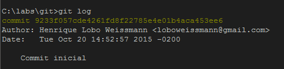
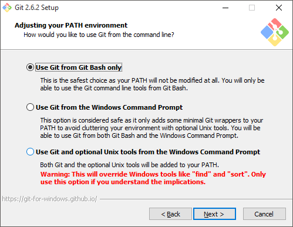
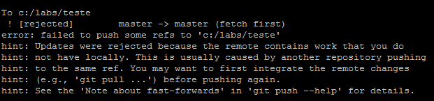
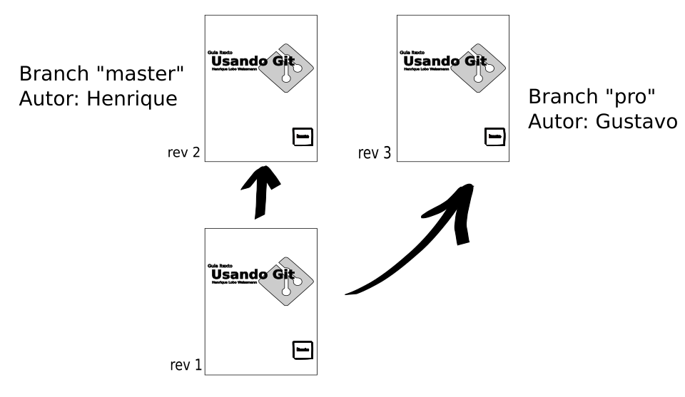
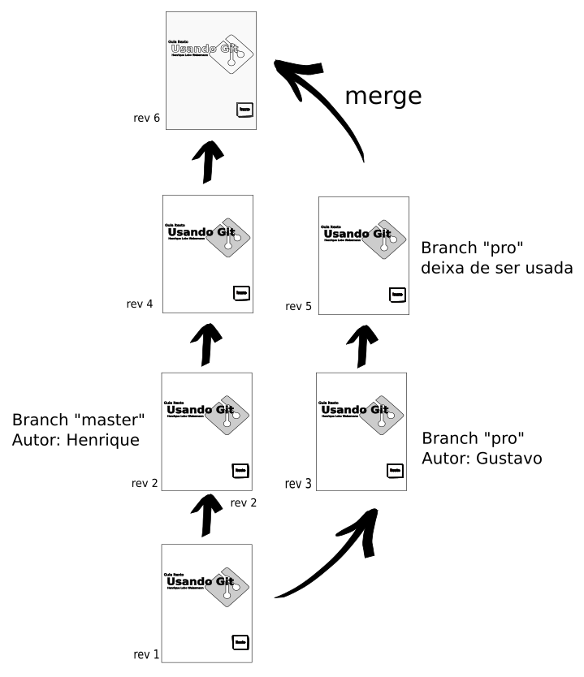

= Usando Git
Henrique Lobo Weissmann <kico@itexto.com.br> 
:doctype: book
:revnumber: 1.0
:revdate: 20/10/2015
:revremark: Primeira edição
:description: Guia de referência rápida e uso do Git escrito pela itexto Consultoria
:front-cover-image: 
:toc:
:toc-title: Índice
:footer: itexto Consultoria - http://www.itexto.com.br

:homepage: http://www.itexto.com.br

== Sobre este guia

Nada melhor que iniciar um guia dizendo o que ele não é: um livro.

Este é um guia rápido para aqueles que precisam lidar com o Git e não sabem por onde começar. Sendo assim não espere encontrar profundas explanações conceituais ou mesmo uma descrição detalhada de todos os comandos disponibilizados pela ferramenta. É apenas o essencial para que você possa dar seus primeiros passos e nada mais.

Naturalmente é inviável não descrever os principais conceitos envolvidos, mas já adiantamos que não será algo profundo: apenas o "essencial do essencial". Isto quer dizer que iremos buscar apenas as definições por trás dos conceitos e não nos preocuparemos (ao menos nesta edição) em incluir a história por trás da evolução de cada termo.

A audiência inicial deste guia são os alunos da itexto para as quais oferecemos nossos treinamentos. Caso você não faça parte de uma destas turmas e obteve este material, sinta-se à vontade: não há problema algum pois o liberamos gratuitamente em nosso site para que mais pessoas possam conhecer o trabalho que desenvolvemos.

Não iremos tratar neste guia de atividades referentes à configuração de servidores ou apresentar aspectos pouco conhecidos do Git. Os comandos aqui apresentados são os mais elementares e sua descrição é feita sob a forma de "livro de receitas", ou seja, apenas descrevemos como resolver os problemas simples que você possa estar enfrentando com a ferramenta.

Nossa principal ferramenta será a interface de linha de comando. Existem opções gráficas bastante interessantes e úteis, capazes de realmente aumentar bastante sua produtividade, mas observamos que o conhecimento obtido através do aprendizado quando usamos a linha de comando se mostra muito mais sólido e permite aos nossos alunos dominar rapidamente todas as demais opções.

É fundamental mencionar que este guia é e sempre será um trabalho incompleto. Conforme nossos leitores apresentem novas dúvidas ou encontrem problemas neste material, o alteraremos sempre que for necessário. Sendo assim, acesse regularmente nosso site para obter uma versão atualizada deste guia: http://www.itexto.com.br  

Qualquer crítica, dúvida ou sugestão, não se acanhe: entre em contato comigo pelo e-mail kico@itexto.com.br

=== Agradecimentos

Agradeço bastante ao Gustavo Watanabe <gustavo@itexto.com.br> que me ajudou na revisão deste guia!

<<<<

== Sobre a itexto

image::images/itexto.png[align="center", width="100px"]

Somos uma empresa de consultoria com foco no desenvolvimento de software com sede em Belo Horizonte que desenvolve sistemas de altíssima qualidade e também ajudamos nossos clientes na execução desta tarefa através do nosso serviço de consultoria

Atualmente nas seguintes frentes:

Treinamentos para empresas:: Ajudamos a sua empresa a dominar as tecnologias nas quais somos referência como, por exemplo, Groovy, Grails, Spring, Java EE
Treinamentos para desenvolvedores independentes:: Através da http://formacao.itexto.com.br[Formação itexto] oferecemos treinamentos voltados para desenvolvedores independentes nas tecnologias que dominamos.
Consultoria:: Projeto e crítica arquitetural, suporte a equipes de desenvolvimento e auxílio de aquisição
Desenvolvimento de sistemas customizados:: Atuamos no projeto, construção e implantação de soluções customizadas para nossos clientes
Evolução de sistemas legados:: Extraímos máximo valor da infraestrutura que nossos clientes já possuem

Atuamos em projetos tanto no Brasil quanto no exterior nas mais variadas áreas: financeira, comércio eletrônico, mineração, saúde, startups, produtos alimentícios, engenharia, tecnologia da informação, educação e pesquisa.

Além disto também atuamos junto com a comunidade de desenvolvimento de software a partir de algumas das nossas iniciativas:

http://www.groovybrasil.com.br[Groovy & Grails Brasil]:: uma das maiores comunidades do mundo de desenvolvedores que usam a linguagem Groovy e tecnologias relacionadas.
http://devall.com.br[/dev/All]:: nosso agragador de blogs de desenvolvedores
http://devkico.itexto.com.br[/dev/Kico]:: blog do nosso co-fundador, Henrique Lobo Weissmann (autor deste guia), que é considerado uma das principais referências sobre Groovy & Grails no Brasil
http://formacao.itexto.com.br[Formação itexto]:: aonde ministramos nossos treinamentos para desenvolvedores independentes nas tecnologias em que somos referência

Você pode entrar em contato conosco através do nosso site (http://www.itexto.com.br), telefone (31 2555-1979) ou e-mail (administrativo@itexto.com.br). 

<<<<

== O que é o Git?

"Fácil: Git é um _sistema de controle de versão distribuído_" extremamente popular entre desenvolvedores.  Esta não é uma boa resposta. Primeiro por que ser _extremamente popular_ não define coisa alguma, segundo por que não foi explicado o que é _"controle de versão"_ e muito menos um _"controle de versão distribuído"_.

Sendo assim vamos quebrar esta resposta e, com isto, obter uma definição mais satisfatória desta ferramenta.

=== Sistemas de controle de versão

_"O que um sistema de controle de versão faz ?"_

.Não se assuste com os comandos
****
Serão expostos alguns comandos do Git nesta seção que ainda não foram tratados. Ignore-os por um momento, pois os veremos com maiores detalhes mais a frente neste guia.
****

Em sua essência este tipo de software lhe permite _versionar_ seu projeto, que pode ser composto por um ou mais arquivos armazenados em um diretório. Quando usamos este verbo - _versionar_ - a ideia que o leitor deve ter em mente diz respeito ao histórico das modificações que executamos sobre um conjunto de arquivos. Nada melhor que um exemplo rápido, o que me diz?

Veja este guia que você está lendo neste momento. Esta é sua primeira edição e para gerar o documento PDF que você tem "em mãos" usamos uma linguagem chamada http://www.asciidoctor.org[_Asciidoctor_] que nos permite, a partir de um arquivo textual, gerar documentos nos formatos PDF, ePub, HTML e muitos outros. 

O projeto deste guia consiste portanto em dois componentes: arquivos texto e de imagem (é o nosso "código fonte"). Finalizada a confecção deste guia, compilamos nosso "código fonte" em um arquivo PDF e o disponibilizamos para nossos leitores. 

Agora, imagine que assim que tenhamos publicado a primeira edição deste guia tenhamos iniciado a confecção da segunda edição. Neste caso basta modificar os arquivos de imagem e texto, certo? Correto, mas nem tanto.

Após publicada a primeira versão do guia um dos nossos leitores nos procurou informando que encontrou um erro no texto. A correção é fácil. Basta procurar o trecho com problemas em nosso texto e alterá-lo. Mas e se já tivermos editado aquela parte. Como encontrar o trecho? É aí que entra o sistema de controle de versões.

==== Repositórios

Um sistema de controle de versões nada mais é que um repositório gerenciado. _Repositório_? Sim: um local no qual seus arquivos se encontram armazenados, tal como um diretório no seu computador. _Gerenciado_? Te explico agora.

Quando usamos um sistema de controle de versão a primeira coisa que fazemos é criar o repositório. No caso do Git, basta entrar na pasta em que o seu projeto se encontra e digitar o comando abaixo:

 git init

==== Adicionando conteúdo ao repositório 

O segundo passo consiste em informar ao repositório quais arquivos devemos versionar. No caso do Git, se quisermos versionar todos os arquivos presentes naquele diretório basta executar o comando `git add .` tal como no exemplo a seguir:

 git add .
 
O comando "add" é enganador. Parece que os arquivos já estão sendo gerenciados mas isto não é verdade *ainda*. O próximo passo é submetê-los ("comitar") ao repositório com o comando *commit* tal como no exemplo abaixo:

 git commit -a
 
Se tudo estiver devidamente configurado, um editor de textos será exposto para você. Neste você deve digitar um texto sucinto explicando quais mudanças foram efetuadas nos seus arquivos, tal como no exemplo abaixo:

 Submissão inicial de arquivos no repositório

==== Inclusão inicial no repositório

Pronto: você acabou de, finalmente, _versiona-los_ no repositório, ou seja, agora há uma versão dos mesmos presente para que você possa consultá-los no futuro. Este conjunto de mudanças que foi enviado ao repositório é o que chamamos de *versão*. 

Toda versão possui um identificador único que nos permite acessá-la a qualquer momento. Caso queira listar todas as versões do seu repositório, basta executar o comando `git log` tal como exposto na imagem abaixo:

==== Desfazendo um erro

Prosseguindo, imagine que tarde da noite eu tenha selecionado todo o conteúdo do guia e acidentalmente pressionado a tecla espaço e, em seguida, salvo o arquivo. Sem o controle de versões nesta hora aqueles que estivessem perto de mim talvez escutariam um grito atordoante.

Se estivesse usando um sistema de controle de versão, não. Para voltar à versão anterior basta executar o comando `git checkout` tal como no exemplo a seguir.

 git checkout guia-itexto-git.adoc
 
Feito: agora você pode até ter perdido o que havia feito desde seu último commit, mas não o conteúdo inteiro. 

.Primeiro contato com controle de versões (e você trabalha sozinho)
****
Se este for seu primeiro contato com um sistema de controle de versões e apenas você trabalha no projeto a ser versionado, pense na ferramenta como o seu "desfazer" ("undo") universal. Aquela ferramenta que lhe permite sempre voltar atrás nos erros que cometeu em seus arquivos.

Digo isto por experiência pessoal: meu primeiro contato com este tipo de ferramenta foi justamente para que eu pudesse sempre voltar a uma versão anterior dos meus arquivos caso cometesse algum erro. :)
****

<<<<

=== O que é ser distribuído?

Agora que temos uma descrição inicial do que é um sistema de controle de versões podemos entender melhor o que vêm a ser um sistema de controle distribuído ou centralizado. 

==== Modelo centralizado

O ideal é começarmos pela definição de um sistema centralizado, em que o repositório encontra-se armazenado apenas em um computador, ou seja, em apenas um ponto está armazenado todo o histórico de modificações do seu projeto gerenciado pelo sistema de controle de versões. Nos demais computadores você encontrará apenas a versão de trabalho (também chamado de workspace) do seu projeto, isto é, a versão corrente dos arquivos.

Há diversos sistemas de controle de versão centralizados hoje. Os mais populares sendo o http://subversion.apache.org[Subversion] e o http://savannah.nongnu.org/projects/cvs/[CVS]. 

A principal desvantagem deste modelo é o ponto de falha óbvio: se o servidor estiver indisponível os participantes do projeto não conseguirão obter versões atualizadas do projeto ou submeter conteúdo para o mesmo. No entanto é uma opção interessante quando, devido a restrições políticas ou de segurança o acesso aos arquivos do projeto deva ser restrito.

==== Modelo distribuído

No modelo distribuído a situação se inverte: não há mais um ponto central no qual todo o histórico de alterações seja armazenado. Todos os clientes possuem uma cópia completa do repositório.

Há algumas vantagens interessantes nesta abordagem:

* Os participantes do projeto poderão trabalhar com o repositório mesmo estando offline
* Há maior segurança, visto que a perda de um nó não irá acarretar na perda de todo o histórico de alterações do projeto
* O desempenho sempre é superior pois quase todas as operações de versionamento serão executadas localmente

No entanto o ponto central não desaparece totalmente. Dado que é importante que os membros do projeto estejam sempre sincronizados, sempre é escolhido um nó como sendo o ponto central usado por todos os demais membros do projeto para que possam estar sempre em sincronia. Houve algum problema com aquele nó? Fácil de resolver: basta eleger outro!

Um exemplo de ponto central usado em muitos projetos são serviços como http://www.github.com[GitHub] ou http://www.bitbucket.org[BitBucket]. A principal vantagem na adoção destes serviços é sua confiabilidade, visto que estão sempre (ou quase) online.

<<<<

== Instalando o Git

=== No Linux

Muito provavelmente sua distribuição Linux já possui o Git instalado. Para verificar isto, basta abrir a sua interface de linha de comando e executar o comando abaixo:

 git
 
Caso não seja exposta uma mensagem de erro dizendo que o comando é desconhecido, você está pronto para começar. Caso contrário, basta que você o instale, o que é bastante simples.

Se sua distribuição usa o APT (como o Ubuntu), basta, como usuário root, executar o comando abaixo:

 apt-get install git
 
ou

 sudo apt-get install git
 
A distribuição usa o YUM? Tão simples quanto. Como usuário root:

 yum install git
 
ou

 sudo yum install git
 
=== No Windows

Por padrão o Windows não vêm com o Git instalado. Sendo assim será necessário baixar o instalador no site oficial do projeto que é o http://git-scm.com

Trata-se de um programa instalador padrão. No site preste atenção que há duas versões: 32 e 64 bits, de acordo com a sua versão do Windows. 

Não clique no botão "Next" sem pensar. Uma das opções da instalação diz respeito à variável *PATH* do seu sistema tal como exposto na imagem a seguir:

Por padrão o Git será instalado no Windows com uma ferramenta chamada "Git Bash" e você só poderá usar a ferramenta a partir desta. Trata-se de uma versão da interface de linha de comandos Bash, presente no Linux, para Windows.

No entanto, na maior parte das vezes você estará usando o próprio *Prompt de Comando* do Windows. A opção recomendada caso você se sinta mais à vontade com o *Prompt de Comando* tradicional é a segunda. 

Muita atenção para a terceira opção. Ela inclui no path do sistema os comandos usados pelo "Git Bash" que são padrão do Linux, alguns dos quais com nomes que conflitam com comandos padrão do Windows como *find* e *sort*. Se para você estes comandos do Windows não são úteis, e gostaria de ter acesso no *Prompt de Comando* a algumas ferramentas do Linux, a terceira opção é a sua escolha.

<<<<

== Conceitos fundamentais

Apesar deste guia ser focado na prática é essencial que você conheça alguns termos adotados pelo Git para que seu aprendizado seja o melhor possível. Neste capítulo os veremos rapidamente para que possamos prosseguir para a prática nos capítulos restantes.

Não iremos aqui nos aprofundar nestes conceitos: daremos apenas uma descrição extremamente sucinta (e talvez até mesmo grosseira) dos mesmos para que você tenha uma ideia inicial do que se tratam, mas nada impede que na segunda ou terceira edição deste guia este capítulo venha a crescer significativamente, conforme as necessidades dos nossos leitores mudem.

=== Commit (ou submissão)

Commit (o famigerado "comitar") é o ato de enviar uma revisão do seu projeto para o repositório. Usaremos bastante no decorrer deste texto este termo, sendo assim é impossível não mencioná-lo aqui. 

=== Workspace e Repositório

Quando você <<init, criar um repositório>> pela primeira vez, será criada uma pasta chamada `.git` dentro do diretório no qual o repositório foi iniciado.

O diretório `.git` é o repositório em si. Nele é que se encontrarão todos os meta-dados sobre as versões gerenciadas pelo Git. Entenda este diretório como *aquele que não deve ser tocado*.

Dentro da pasta na qual foi iniciado o repositório, tudo o que se encontra fora de `.git` é o seu _workspace_ (também conhecido como _diretório de trabalho_). Estes são os arquivos que compõem o seu projeto e nos quais você estará trabalhando.

=== Snapshot

Quando submetemos uma revisão para o repositório, o Git a armazena como um _snapshot_. Pense no _snapshot_ como se fosse uma fotografia do seu _diretório de trabalho_ em um dado momento. Na prática o _snapshot_ corresponde à sua revisão.

Esta é uma diferença muito importante entre o Git e outros sistemas de controle de versão como, por exemplo, o Subversion, que internamente armazena apenas as diferenças entre os arquivos e é em grande parte responsável pelo desempenho excepcional do Git em relação a outros sistemas de controle de versão.

=== Os três estados do arquivo: committed, modified e staged

Esta é talvez a parte que os iniciantes mais tem dificuldade em entender em seu primeiro contato com o Git. Todo arquivo gerenciado pelo Git passa por três estágios em sua existência.

[[staged]]
O primeiro deles é o que chamamos de `staged`. É quando o usuário informa ao Git que aquele conteúdo deverá fazer parte da próxima submissão para o repositório. Veremos mais sobre isto ao tratarmos o comando <<add, `git add`>>. 

Existe portanto uma área dentro do repositório que se chama `staged area`. Pense nela como o seu pré-commit, ou seja, qual o conteúdo do próximo commit a ser feito no repositório.

O próximo estado é `committed`. Neste estado o arquivo encontra-se armazenado no repositório.

Finalmente, temos o `modified`, que é quando o arquivo já foi comitado e seu conteúdo foi alterado. Importante mencionar que isto não quer dizer que o arquivo irá fazer parte do próximo commit. Ele apenas o fará quando o incluirmos na `staged area` do repositório.

Confuso? Tudo ficará mais claro nas próximas páginas. O importante é que tenha estes termos em mente.

<<<<

== Quando se trabalha isolado

Para fins didáticos vamos primeiro ver como lidar com repositórios isoladamente. As tarefas que serão expostas aqui são essenciais para que possamos progredir mais à frente, quando veremos repositórios remotos e branches.

Deste ponto em diante neste guia a nossa ferramenta principal será sua interface de linha de comando. 

=== Criando um repositório (init) [[init]]

Para criarmos um novo repositório usamos o comando `git init` tal como exposto no exemplo abaixo:

 git init
 
Executado este comando será criado um subdiretório chamado `.git`. *Este* é o real repositório. O que se encontra do lado de fora é o nosso espaço de trabalho (também chamado de _workspace_), ou seja, os arquivos nos quais estamos trabalhando e que podem ou não estar sendo gerenciados pelo Git.

Há também outra forma para este comando. Se você passar um nome qualquer como parâmetro, um novo diretório será criado e neste será iniciado este novo repositório, tal como no exemplo a seguir no qual o diretório `guia-itexto` é criado e nele iniciado um novo repositório Git.

 git init guia-itexto
 
.Conceitos importantes: Workspace e Repositório
****
Repositório é aonde ficam armazenadas todas as revisões dos arquivos que são gerenciados pelo Git (o diretório .git)
 
Workspace ou diretório de trabalho é onde ficam os arquivos nos quais você está trabalhando.
****

=== Clonando um repositório (clone) [[clone]]

Talvez você já tenha um repositório criado e queira criar uma cópia do mesmo. Este processo de cópia é o que chamamos de *clonagem*. Novamente, o comando a ser usado é bastante simples: `git clone` e sua sintaxe *essencial* é exposta abaixo:

 git clone [caminho para o repositório de origem] [caminho aonde o repositório será clonado ou URL]
 
O caminho para o repositório de origem pode ser tanto uma URL quanto um diretório. É importante mencionar que o segundo argumento, ou seja, o caminho no qual o diretório será clonado é opcional. Caso seja omitido, será criado uma nova pasta cujo nome será o mesmo que o repositório de origem.

Qual o nome do repositório de origem? É o último elemento da URL ou pasta que o armazena. Observe o exemplo abaixo:

 git clone http://github.com/itexto/teste
 
O nome do repositório de origem é *teste*, e como omitimos o caminho informando aonde o repositório será clonado, ele o será, no diretório corrente, em uma nova pasta chamada *teste* também.

Vamos a mais um exemplo:

 git clone /repos/importante /repos/copias/bagunca
 
Aqui estamos clonando o repositório `/repos/importante` na pasta `/repos/copias/bagunca` em nosso computador.

=== Adicionando arquivos ao repositório (add) [[add]]

Um repositório criado não é de muita serventia se não possuir conteúdo que possa gerenciar. Para adicionarmos arquivos ao repositório, usamos o comando `git add`, que na realidade adiciona os arquivos na <<staged, `staged area`>> do repositório para que sejam incluídos no próximo commit.

Deseja adicionar todos os arquivos ao repositório? Use o comando a seguir:

 git add .
 
Deseja adicionar apenas um arquivo? Substitua o "." pelo nome do mesmo, tal como no exemplo a seguir:

 git add guia-itexto-git.ad
 
Você também pode usar o caractere coringa "*" ou "?". Imagine que deseja dicionar todos os arquivos com a extensão ".adoc". Como você faria?

 git add *.adoc
 
.Importante
****
Quando adicionamos um arquivo ao repositório nós apenas informamos o Git a respeito da sua existência. Ainda não há nenhuma versão gerenciada para os mesmos, pois encontram-se apenas na <<staged, `staged area`>>.
****

=== Submetendo uma versão para o repositório (commit)

Você submete uma versão para o repositório usando o comando `git commit`. A forma mais simples deste comando é exposta a seguir:

 git commit [arquivo]
 
Com isto você informa ao Git para armazenar uma nova versão apenas do arquivo passado como parâmetro. Raras vezes este é o caso, pois normalmente você estará editando vários arquivos e submetendo a revisão dos mesmos, todos de uma vez para o seu repositório. Sendo assim, o parâmetro `-a` entra em ação, tal como no exemplo a seguir:

 git commit -a
 
O parâmetro `-a` informa ao Git para armazenar a revisão de todos os arquivos versionados (e registrar a exclusão dos que foram removidos) e que já possuem uma entrada no repositório ou já tenham sido incluídos na `staging area`.

Sempre que o commando `git commit` é executado e arquivos foram alterados ou excluídos, um editor de textos lhe será apresentado. Nele você deve fornecer um texto conciso informando o que foi modificado. Esta informação é fundamental quando for lidar com outros membros da sua equipe, pois fornece o contexto dentro do qual as modificações foram efetuadas. 

.Importante
****
Toda submissão só é armazenada no repositório se houver uma mensagem descrevendo o que foi modificado. Se você fechar seu editor sem salvar a mensagem o commit não será realizado.
****

Se você quiser, dentro do mesmo comando pode já passar esta mensagem de uma vez, evitando com isto a execução do editor de textos. Para tal basta usar o parâmetro `--message` tal como no exemplo a seguir:

 git commit -a --message=Um commit importante!
 
=== Removendo arquivos do repositório (rm)

Pode ser que você tenha incluído acidentalmente um arquivo no seu repositório. Este é um problema fácil de ser resolvido. Basta executar o comando `git rm` cuja sintaxe é exposta a seguir:

 git rm [arquivo]
 
Este comando irá apagar o arquivo tanto do seu diretório de trabalho quanto do repositório.

=== Evitando que arquivos indesejados sejam incluídos no repositório (.gitignore)

Sempre há arquivos que não desejamos que sejam versionados como, por exemplo, logs, binários e conteúdo temporário. O Git nos oferece uma solução bastante simples para este problema: trata-se do arquivo `.gitignore` , que deve estar armazenado no diretório raíz do seu projeto (workspace) e cuja sintaxe é bastante simples.

Em cada uma das suas linhas, basta digitar o nome do arquivo ou uma expressão contendo caracteres coringa. Se seu projeto sempre gera o arquivo `stacktrace.log`, e este você não gostaria de ver versionado, basta que o conteúdo do `.gitignore` seja tal como o exposto a seguir:

....
stacktrace.log
....

Nenhum arquivo de log deve ser incluído? Simples!

....
*.log
....

Mas esta regra se aplica apenas ao diretório raíz do workspace. E se quiséssemos referenciar *qualquer* arquivo de log?

....
**/*.log
....

O `**` representa algo como "qualquer diretório e subdiretório". É também possível incluir comentários no arquivo `.gitignore`. Para tal, basta incluir o caractere `#`: o conteúdo até o final da linha será ignorado pelo Git. Mais um exemplo?

....
# Conteúdo da pasta target
**/target/**
# Arquivos de log
**/*.log
# Arquivos .class
**/*.class
....

É uma excelente prática, ao se iniciar um projeto, incluir como primeiro arquivo o `.gitignore` já configurado, pois com isto se reduz significativamente o risco de algum membro da equipe acidentalmente incluir no repositório arquivos que devam ser ignorados.

.Importante
****
O arquivo `.gitignore` não é invisível.

Dado que em alguns sistemas operacionais o arquivo não é exposto no navegador de arquivos (tal como no Windows ou no Nautilus do GNOME), muitas vezes os usuários do Git simplesmente esquecem-se da sua existência.
****

=== Revertendo mudanças em arquivos locais (checkout)

Há aqueles momentos em que acidentalmente alteramos o conteúdo do arquivo de uma forma equivocada e em seguida o salvamos. Como reverter o arquivo que se encontra no seu workspace para a última versão comitada? 

 git checkout [nome do arquivo]
 
Apenas isto. Agora o arquivo estará idêntico ao que se encontra na última revisão enviada para o repositório. Falaremos mais sobre o comando `checkout` no próximo capítulo. 

<<<<

== Quando se trabalha em equipe

Tal como dito no capítulo anterior, os fatores que tornaram Git tão popular são seus recursos quando precisamos trabalhar em equipe. Chegou o momento de saber como lidar com repositórios compartilhados e branches!

=== Entendendo os repositórios remotos

Quando falamos sobre como <<clone, clonar>> repositórios, mencionamos que você pode passar como parâmetro uma URL como, por exemplo, um repositório hospedado no http://www.github.com[GitHub], http://www.bitbucket.com[BitBucket] ou mesmo algum outro computador na sua rede ou pasta presente em seu HD. 

Se você clonou um repositório remoto, o Git automaticamente armazena entre seus meta-dados o nome da origem a partir da qual foi feita a cópia. O nome padrão é `origin`. Você pode ter acesso a estas informações executando o comando `git remote -v` tal como no exemplo a seguir: [[remote]]

 git remote -v
 
O parâmetro `-v` instruí o comando a expor também a URL que originou a cópia, tal como pode ser visto na listagem a seguir:

 origin  http://www.github.com/itexto/guia-itexto-git.git
 
É possível referenciar mais de uma fonte remota em um mesmo repositório, o que lhe possibilita enviar suas atualizações para diferentes destinos. 

Para adicionar uma nova fonte remota, exeucte o comando `git remote` com a sintaxe abaixo:

 git remote add [nome da fonte remota] [URL da mesma]
 
Se quisermos adicionar a fonte remota opcional dentro da nossa rede, por exemplo, poderíamos executar o comando a seguir:

 git remote add rede http://servidor/repositorio
 
Executando o comando `git remote -v` novamente obteríamos o resultado a seguir:

 origin  http://www.github.com/itexto/guia-itexto-git.git
 rede    http://servidor/repositorio

É possível também remover um repositório remoto. Para tal usamos o comando `git remote remove` com a sintaxe abaixo:

 git remote remove [nome do repositório]

Podemos remover a menção ao repositório `rede` usando o seguinte comando, portanto:

 git remote remove rede
 
=== Mantendo seu repositório local sincronizado (pull)

Quando se fala de Git muita gente pensa imediatamente no http://www.github.com[GitHub] que é de longe a forma mais popular de se compartilhar código fonte no mundo. Nós já vimos como <<clone, clonar>> repositórios, portanto a maior parte do que precisamos saber a este respeito já está pronto. Agora devemos conhecer o fluxo de trabalho que normalmente seguimos ao trabalharmos em equipe usando um repositório Git compartilhado.

Após ter clonado seu repositório, a primeira coisa que costumamos fazer diáriamente antes de iniciar nosso trabalho é obter as versões mais atuais presentes no repositório que definimos como sendo o central. Não é preciso fazer muita coisa: basta executar o comando `git pull` tal como no exemplo abaixo:

 git pull
 
Este comando irá buscar todas as atualizações presentes no repositório central a partir do qual você clonou seu repositório e as trará para o seu repositório local (não se preocupe com a questão dos conflitos, falaremos sobre ela mais a frente). 

Ao executar o comando `git pull`, dependendo do modo como o repositório central estiver configurado poderão lhe ser pedidas suas credenciais (login e senha). Fornecendo-as e estas sendo aceitas, não há muito mais o que falarmos aqui a este respeito.

Até este momento usamos o comando `git pull` em um repositório que possui apenas um repositório remoto registrado. E quando possuímos mais de um, como fazemos? Usamos a sintaxe abaixo:

 git pull [nome do repositório]
 
Exemplo: buscando as atualizações a partir do repositório `rede`

 git pull rede

[[fetch]]Há outro comando que podemos usar para obter as atualizações provenientes de um repositório remoto que ainda não foi mencionado: trata-se do comando `git fetch` que possui a mesma sintaxe do comando `git pull`. A diferença é que `git fetch` atualiza apenas o seu repositório e não seu diretório de trabalho. Quando executamos o comando `git pull`, além de atualizarmos o repositório, também atualizamos nosso diretório de trabalho.

Na realidade, após ter executado o comando `git fetch`, você precisará executar uma mesclagem (`merge`), que é um assunto que trataremos mais a frente neste texto.
 
=== Enviando suas atualizações para o repositório central (push)

O segundo passo sempre é o envio das suas modificações para o repositório central. Fazemos isto com o comando `git push` que pode ser executado tal como no exemplo a seguir:

 git push
 
Estando tudo ok, todas as revisões que você armazenou no seu repositório local e que não haviam ainda sido submetidas para o repositório central serão enviadas a este. Há a possibilidade de no momento em que o comando `push` ser executado você se deparar com uma mensagem de erro tal como a exposta na imagem a seguir:

Git não permite que você execute o comando `push` caso existam revisões no repositório remoto que ainda não estejam presentes no seu repositório local. Como resolver o problema? Simples: execute o comando `git pull` e, em seguida, não havendo conflitos, execute novamente o comando `git push`.

Usamos o comando `git push` até este momento apenas para os casos nos quais há apenas um repositório de origem referenciado pelo Git. E quando quisermos enviar todo o nosso conteúdo para outro repositório remoto? Usamos a sintaxe abaixo:

 git push [nome do repositório]
 
Exemplo: enviando nossas mudanças para o repositório `rede`

 git push rede
 
=== Branches [[branches]]

Branches são um dos recursos mais importantes (talvez O) em um sistema de controle de versões. Essencialmente elas te permitem ter mais de uma linha de trabalho em paralelo, sem que um usuário (ou grupo) influencie diretamente no trabalho de outro. Vamos a um exemplo?

Imagine que este guia tenha sido um sucesso. Em um primeiro momento apenas um autor trabalhou neste conteúdo (Eu), no entanto depois observamos que poderíamos usar a mesma base do livro para poder escrever outro, mais completo sobre o mesmo assunto.

Neste momento entra em ação um segundo autor, Gustavo, que irá trabalhar na versão *completíssima* do Guia, enquanto eu, Henrique, trabalho na versão básica incluindo algumas melhorias. O que fazemos? Criamos uma branch, tal como exposto na imagem a seguir:

Criamos uma nova branch na qual Gustavo irá evoluir seu texto na versão profissional enquanto eu, Henrique, continuo evoluindo a versão básica do guia. Em nossa organização a principal mudança a ser feita na edição profissional deste trabalho será a inclusão de novos capítulos, sendo assim Gustavo não iria alterar os capítulos já alterados. 

No entanto, conforme o tempo passa, percebemos que seria bobagem termos duas versões distintas do mesmo livro. Então, por que não ter uma só, trazendo todas as melhorias feitas por Gustavo para a branch "master"? É o que chamamos de mesclagem (merge), ou seja, quando unimos o conjunto de mudanças presentes em uma branch com outra, tal como exposto no diagrama abaixo:

Este é basicamente o fluxo essencial de trabalho quando lidamos com branches. Você as cria, trabalha nelas e, eventualmente, as mescla seguindo alguma política de gestão de configuração definida por sua empresa ou equipe. Há diversas práticas (boas e más) aplicadas nesta área da computação que não se encaixam neste guia para iniciantes. Sendo assim, daqui para frente iremos voltar ao nosso formato "livro de receitas" expondo como executar as tarefas mais comuns envolvendo esta importante funcionalidade.

=== Criando uma branch (checkout -b)

Criamos uma nova branch com o comando `git checkout -b` usando a sintaxe abaixo:

 git checkout -b [nome da branch]
 
No exemplo a seguir criamos uma branch chamada `melhorias`:

 git checkout -b melhorias
 
Importante salientar que no momento em que criamos uma branch, esta passa a ser nossa branch atual, e não mais a `master`, que é a padrão quando criamos o repositório.

=== Listando branches e descobrindo a atual (branch)

Para listar branches, usamos o comando `git branch`, que nos irá expor uma saída similar à exposta a seguir:

 master
 * melhorias
 
O asterisco (`*`) indica qual a branch atual do repositório. Se quisermos listar todas as branches presentes em repositórios remotos, usamos o comando `git branch --all`, que nos irá expor um resultado similar ao exposto no exemplo a seguir:

----
* desenvolvimento
integracao
remotes/origin/teste -> origin/master
----
 
A terceira branch listada encontra-se no repositório `origin` e é identificada neste como `master`.

=== Mudando de branch (checkout)

Para mudar de branch, use o comando `git checkout` com a sintaxe abaixo:

 git checkout [nome da branch]
 
Para voltarmos à branch `master`, portanto, usaríamos o comando abaixo:

 git checkout master
 
Caso você tenha mudanças no seu diretório de trabalho que ainda não tenham sido comitadas, o Git não irá executar o comando, lhe enviando uma mensagem de erro. Caso queira jogar fora as mudanças no seu ambiente de trabalho e mesmo assim mudar para uma outra branch, use o parâmetro `-f`, tal como no exemplo a seguir, que descarta todas as mudanças que fizemos na branch `melhorias` ao mudarmos para `master`:

 git checkout -f master
 
=== Submetendo commits para uma branch remota (git push repositorio branch)

Usamos o mesmo comando `git push` que vimos anteriormente neste guia. A diferença é que além de enviarmos o nome do repositório, também fornecemos o nome da branch que receberá as mudanças, tal como no exemplo a seguir, que submete todas as mudanças da branch `melhoria` para o repositório `rede`.

 git push rede melhoria
 
=== Obtendo todas as mudanças feitas em uma branch remota (git pull repositorio branch)

Novamente iremos usar o comando `git pull`, só que também passando como parâmetro o nome do repositório e a branch que queremos obter, tal como no exemplo abaixo em que iremos obter todas as melhorias presentes na branch `melhorias` do repositório `rede`:

 git pull rede melhoria
 
=== Mesclando branches (merge)

Mesclar branches é razoávelmente simples. Basta que você use o comando `git merge` que possui a sintaxe abaixo:

 git merge [branch origem]
 
Importante mencionar como deve ser interpretado este comando. Sempre pense nele como "estou trazendo para a minha branch corrente todas as mudanças que foram feitas na branch que passei como parâmetro".

<<<<

== Finalizando

Se você chegou até este ponto do guia, muito obrigado por sua dedicação! Estamos na primeira edição deste material e com certeza ainda há muito o que melhorar. Caso tenha encontrado algum problema, por favor entre em contato comigo por e-mail: kico@itexto.com.br

Toda crítica e sugestão é extremamente bem vinda. Como pode ver, não nos aprofundamos em nenhum dos assuntos tratados, apenas lhe fornecemos uma explicação rápida a respeito dos principais comandos oferecidos pelo Git. Para conhecer em profundidade a ferramenta, recomendamos que use os recursos adicionais presentes no capítulo que se segue.

Muito obrigado e até o próximo guia (ou livro)!

<<<<

== Recursos adicionais

Este é um guia extremamente simples para aqueles que estão dando seus primeiros passos com Git, sendo assim é natural que diversos aspectos importantes tenham sido tirados desta edição. Caso o leitor tenha interesse em se aprofundar na ferramenta, segue uma lista de recursos extremamente interessantes que poderão lhe auxiliar nesta jornada.

Todos os recursos abaixo citados podem ser obtidos gratuitamente. 

Pro Git::
de Scott Chacon e Ben Straub, que você pode obter gratuitamente no site oficial do Git em http://git-scm.com/book/en/v2
Cheat Sheet do GitHub::
um excelente recurso para consultas rápidas sobre os principais comandos do Git https://training.github.com/kit/downloads/github-git-cheat-sheet.pdf 
Referência rápida oficial do Git::
a referência rápida presente na documentação oficial do Git é muito boa: http://git-scm.com/docs
Git Internals::
de Scott Chacon, expõe com detalhes como o Git realmente funciona - https://github.com/pluralsight/git-internals-pdf/raw/master/drafts/peepcode-git.pdf 

